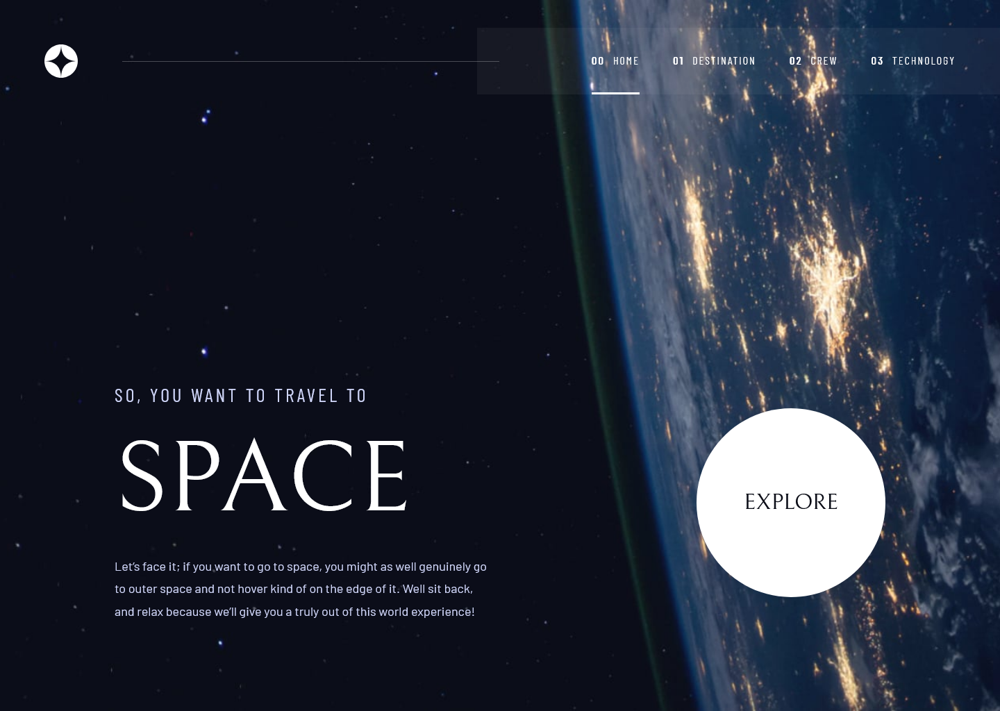

# Space Tourism Website

## Table of contents

- [Overview](#overview)
  - [The challenge](#the-challenge)
  - [Preview](#preview)
  - [Links](#links)
- [My process](#my-process)
  - [Built with](#built-with)
  - [What I learned](#what-i-learned)
  - [Continued development](#continued-development)

## Overview

### The challenge

Users should be able to:

- View the optimal layout for each of the website's pages depending on their device's screen size
- See hover states for all interactive elements on the page
- View each page and be able to toggle between the tabs to see new information

### Preview



### Links

- Live Site URL: [Click Me](https://space-tourism-website-pi-jade.vercel.app/)

## My process

### Built with

- [React](https://reactjs.org/)
- [TypeScript](https://www.typescriptlang.org/)
- [Vite](https://vite.dev/)
- [Tailwind CSS](https://tailwindcss.com/)
- [React Router](https://reactrouter.com/)

### What I learned

#### React Router for client-side navigation

I learned how SPAs handle navigation by intercepting browser requests and swapping components instead of loading new pages, while still updating the URL for bookmarking and back button support to improve UX.

```jsx
<Routes>
  {navItems.map((item) => {
    const Component = item.component;
    return <Route key={item.path} path={item.path} element={<Component />} />;
  })}
</Routes>
```

#### Dynamic backgrounds per route

Used useLocation from React Router to apply different background images depending on the current route:

```js
const location = useLocation();
const currentNavItem = navItems.find(
  (item) => item.path === location.pathname,
);
const bg = currentNavItem?.background;

<div style={{ backgroundImage: `url(${bg})` }}>
```

### Continued development

#### Accessibility

I want to make accessibility a more deliberate part of my process going forward (semantic HTML elements, ARIA attributes, keyboard navigation, or screen reader testing).

#### Animations and transitions

I implemented basic fade transitions but want to explore more sophisticated animation libraries like Motion for more polished interactions.

#### Next.js

I want to migrate from Vite to Next.js to take advantage of server-side rendering for better SEO, something a pure React/Vite app can't do out of the box.

##

This is a solution to the [Space tourism website challenge on Frontend Mentor](https://www.frontendmentor.io/challenges/space-tourism-multipage-website-gRWj1URZ3). Frontend Mentor challenges help you improve your coding skills by building realistic projects.
